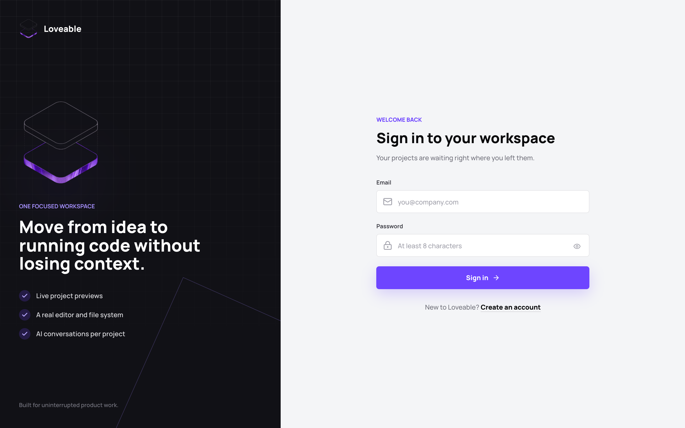
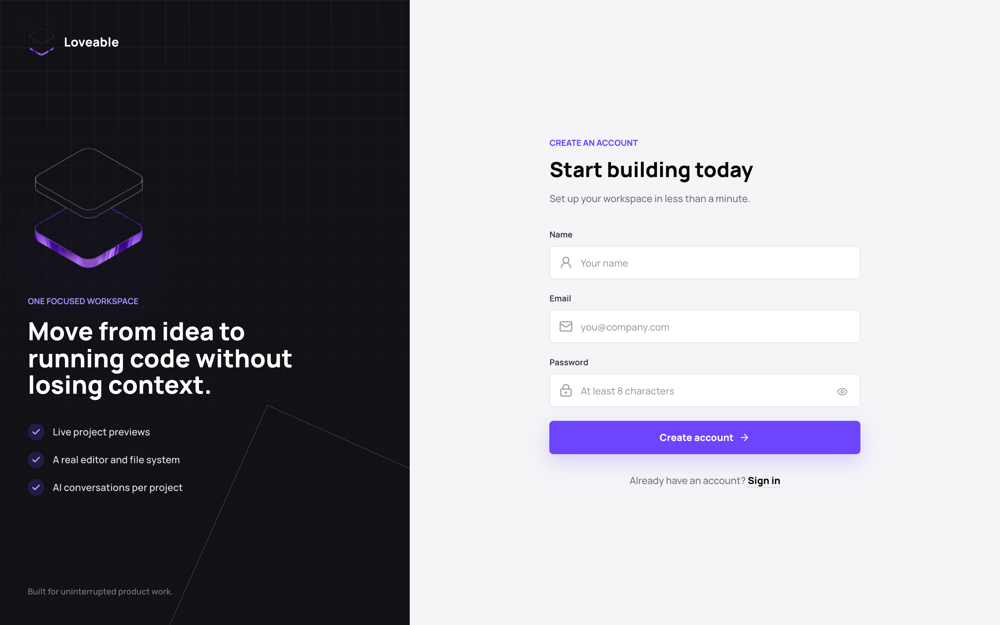
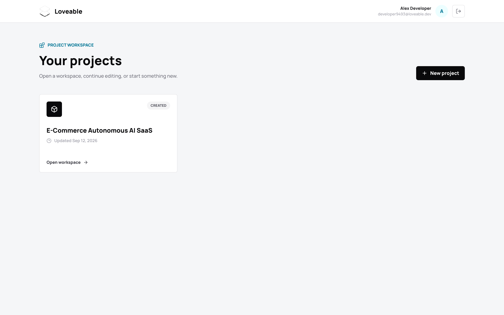
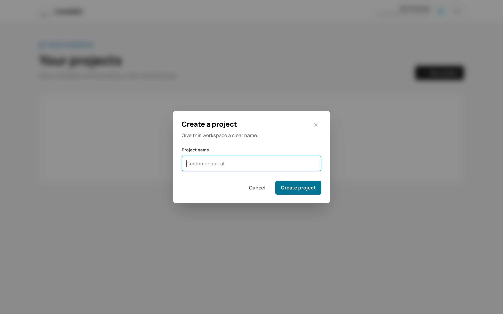
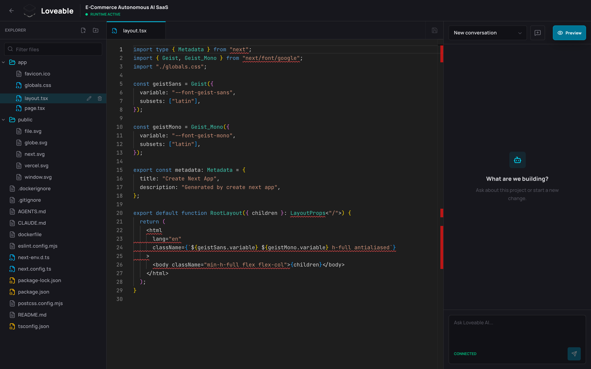
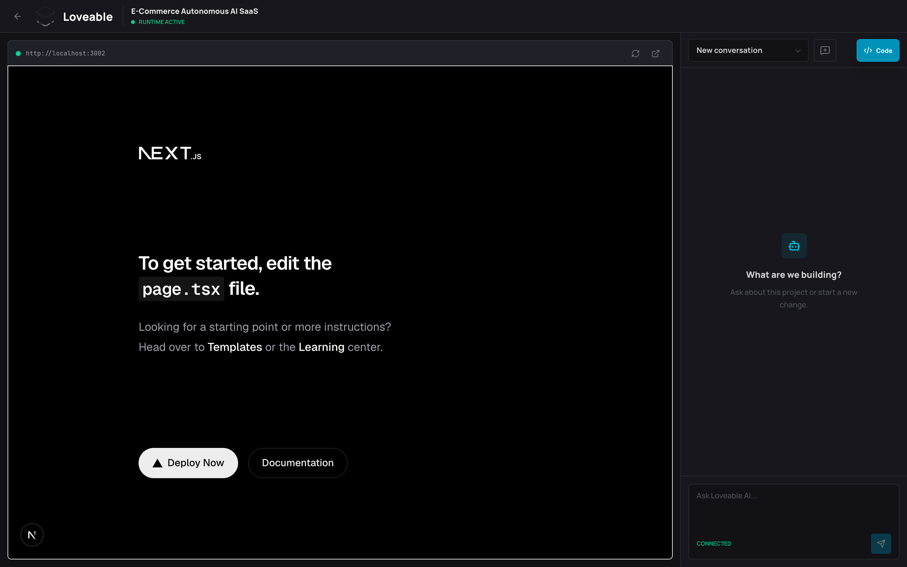
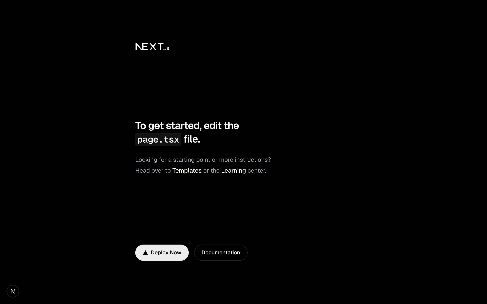
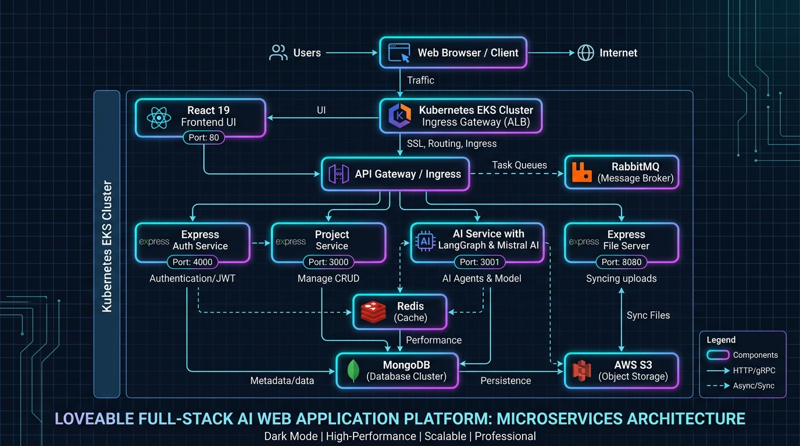

# ⚡ Loveable — Full-Stack Autonomous AI Web Application Platform

> An enterprise-grade, microservice-powered cloud IDE and autonomous AI coding platform (similar to Bolt.new / Loveable.dev). Loveable empowers developers to build, edit, preview, and deploy full-stack web applications in real-time using interactive AI agent prompts.

---

### 📷 Application Route Screens & System Preview

#### 🔑 1. Sign In Route (`/login`)
User authentication portal with HttpOnly JWT session integration and password validation.


#### 📝 2. User Registration Route (`/register`)
Account creation portal with instant session creation and JWT token issuance.


#### 📁 3. Projects Workspace Dashboard Route (`/projects`)
Central user dashboard for managing projects, creating new projects, and launching workspace runtimes.


#### ➕ 4. Create New Project Modal
Modal dialog to initialize a new workspace environment and scaffold the starter boilerplate.


#### 💻 5. Cloud IDE Workspace Route (`/projects/:projectId`)
Full-featured browser workspace with Monaco Editor, tree view file explorer with custom icons, streaming AI chat panel, and hot-reloading web preview toggle.


#### ⚡ 6. Working Live Application Preview (Integrated Mode)
Real-time hot-reloading iframe rendering generated web application components live inside the workspace with active AI assistance.


#### 🌐 7. Standalone Application Output (`http://localhost:3002`)
Direct view of the running Next.js application served by Turbopack.


#### 🏗️ 8. Microservice Architecture & Infrastructure Diagram
Enterprise microservice topology diagram showing Frontend, Auth Service, Project Service, AI Service, File Server, AWS S3 Sync, MongoDB, Redis, RabbitMQ, and EKS Ingress.


---

### ✨ Key Features & Capabilities

- 🤖 **AI-Driven Code Generation & Refactoring**: Autonomous LangGraph agent workflow powered by Mistral AI for multi-file generation, code editing, directory creation, and real-time Server-Sent Events (SSE) streaming.
- 💻 **Browser Cloud IDE**: High-performance browser workspace powered by Monaco Editor (`@monaco-editor/react`), multi-tab file editing, tree view navigation (`react-arborist`), and real-time state management.
- ⚡ **Instant Live Preview**: Dynamic reverse-proxy runtime routing for immediate, hot-reloading browser previews of generated projects.
- 🔐 **Secure Microservice Authentication**: Dedicated Express JWT Authentication service with access/refresh token rotation, HttpOnly cookie persistence, password hashing (`bcryptjs`), and MongoDB user persistence.
- 🚀 **Kubernetes Pod Lifecycle Manager**: Automated container provisioning, pod health monitoring, readiness/liveness checks, and idle workspace reaping (`PREVIEW_IDLE_TTL_MS`).
- 🔄 **Real-Time AWS S3 Sync**: Two-way workspace file watcher built on `chokidar` with debounced, concurrent batch file uploads to AWS S3 storage buckets.
- 📁 **Dedicated File Management API**: Dedicated RESTful filesystem server (`express-file-server`) supporting batch reads/writes, file tree construction, and workspace directory operations.
- 📦 **Next.js Workspace Starter**: Pre-configured `nextjs-boilerplate` template for fast application scaffolding.
- ☸️ **Cloud Native Infrastructure**: Production-ready Kubernetes manifests (`k8s/`), Nginx Ingress wildcard host routing (`*.preview.cryboy.in`), and Skaffold deployment pipelines for AWS EKS.

---

### 🧩 Microservices Overview

| Microservice | Port / Protocol | Primary Tech Stack | Key Responsibility |
| :--- | :--- | :--- | :--- |
| **`frontend`** | `5173` (HTTP) | React 19, Vite, Tailwind v4, Monaco Editor | User dashboard, browser IDE, AI chat panel, live iframe preview |
| **`auth-service`** | `4000` (HTTP) | Express, Mongoose, MongoDB, JWT, bcryptjs | User sign-up/login, session restoration, JWT token management |
| **`project-service`** | `3000` (HTTP) | Express, `@kubernetes/client-node`, Redis, RabbitMQ | Project CRUD, K8s pod launcher, preview proxy, idle reaper |
| **`ai-service`** | `3001` (HTTP/SSE) | Express, LangChain, LangGraph, Mistral AI | AI agent logic, streaming response generation, code edits |
| **`express-file-server`** | `8080` (HTTP) | Express, Node.js FS | File tree listing, file reads/writes over project work directory |
| **`sync-service`** | Worker Process | Node.js, Chokidar, AWS SDK S3 | Two-way file sync between workspace storage and AWS S3 |

---

### 🛠️ Architecture & Tech Stack

```
                        ┌────────────────────────┐
                        │   React 19 Frontend    │
                        │   (Vite / Tailwind)    │
                        └───────────┬────────────┘
                                    │ HTTP / REST / SSE
         ┌──────────────────────────┼──────────────────────────┐
         ▼                          ▼                          ▼
┌──────────────────┐       ┌──────────────────┐       ┌──────────────────┐
│   Auth Service   │       │ Project Service  │       │    AI Service    │
│   (Port 4000)    │       │   (Port 3000)    │       │   (Port 3001)    │
└────────┬─────────┘       └────────┬─────────┘       └────────┬─────────┘
         │                          │                          │
         │ Mongoose                 │ Mongoose / Redis         │ LangGraph / Mistral
         ▼                          ▼                          ▼
┌──────────────────┐       ┌──────────────────┐       ┌──────────────────┐
│  MongoDB (Auth)  │       │ MongoDB / Redis  │       │  RabbitMQ Broker │
└──────────────────┘       └──────────────────┘       └──────────────────┘
```

- **Frontend**: React 19, Vite, TailwindCSS v4, React Router 7, Monaco Editor, React Arborist, Lucide Icons
- **Backend Services**: Node.js, Express, TypeScript (`tsx`), Mongoose, ioredis, amqplib (RabbitMQ)
- **AI Engine**: LangChain, LangGraph, Mistral AI (`@langchain/mistralai`), Zod, LangSmith Tracing
- **Database & Queues**: MongoDB, Redis, RabbitMQ
- **Cloud Storage & Infra**: AWS S3, Kubernetes (AWS EKS), Nginx Ingress Controller, Skaffold

---

### 🚀 Quick Start Guide

#### Prerequisites
- **Node.js**: `v20.x` or higher
- **npm**: `v10.x` or higher
- **MongoDB**: Running locally on `mongodb://localhost:27017` (or remote MongoDB URI)
- **Redis & RabbitMQ**: (Optional for local frontend/auth dev; required for background task messaging)

#### 1. Repository Setup & Dependencies
```bash
git clone https://github.com/your-org/loveable.git
cd loveable

# Install dependencies across all microservices
cd frontend && npm install && cd ..
cd auth-service && npm install && cd ..
cd project-service && npm install && cd ..
cd ai-service && npm install && cd ..
cd express-file-server && npm install && cd ..
cd sync-service && npm install && cd ..
```

#### 2. Configure Environment Variables
Create `.env` configuration files in each respective microservice directory:

**`auth-service/.env`**:
```env
PORT=4000
MONGODB_URI=mongodb://localhost:27017/auth_db
ACCESS_TOKEN_SECRET=dev_access_token_secret_32bytes_minimum_key
REFRESH_TOKEN_SECRET=dev_refresh_token_secret_32bytes_minimum_key
ACCESS_TOKEN_EXPIRY=15m
REFRESH_TOKEN_EXPIRY=7d
NODE_ENV=development
```

**`project-service/.env`**:
```env
PORT=3000
MONGODB_URI=mongodb://localhost:27017/project_db
ACCESS_TOKEN_SECRET=dev_access_token_secret_32bytes_minimum_key
MESSAGE_BROKER_URL=amqp://localhost:5672
REDIS_URL=redis://localhost:6379
```

**`ai-service/.env`**:
```env
PORT=3001
MONGODB_URI=mongodb://localhost:27017/ai_db
ACCESS_TOKEN_SECRET=dev_access_token_secret_32bytes_minimum_key
MESSAGE_BROKER_URL=amqp://localhost:5672
MISTRAL_API_KEY=your_mistral_api_key
```

**`express-file-server/.env`**:
```env
PORT=8080
WORK_FOLDER=/tmp/work
```

#### 3. Start Development Servers

Start each service in individual terminal windows or using process managers:

```bash
# 1. Auth Service
cd auth-service && npm run dev

# 2. Project Service
cd project-service && npm run dev

# 3. AI Service
cd ai-service && npm run dev

# 4. Express File Server
cd express-file-server && npm run dev

# 5. Frontend Client
cd frontend && npm run dev
```

Navigate to `http://localhost:5173` in your browser to launch the Loveable IDE.

---

### ☁️ Kubernetes & EKS Deployment

To deploy the entire microservice architecture to an AWS EKS cluster:

```bash
# Build multi-architecture images and deploy via Skaffold
skaffold run -f skaffold-eks.yaml
```

**Ingress Routing Configuration**:
- `www.cryboy.in/api/auth` ──► Auth Service (`:4000`)
- `www.cryboy.in/api/projects` ──► Project Service (`:3000`)
- `www.cryboy.in/api/ai` ──► AI Service (`:3001`)
- `*.preview.cryboy.in` ──► Dynamic Project Container Preview

---

### 📂 Directory Structure

```
loveable-main/
├── ai-service/              # LangGraph & Mistral AI streaming service
├── auth-service/            # Express auth & user session microservice
├── express-file-server/     # RESTful workspace file management API
├── frontend/                # React 19 + Vite + Monaco Cloud IDE interface
├── nextjs-boilerplate/      # Template container starter project
├── project-service/         # Project CRUD & Kubernetes pod launcher
├── sync-service/            # AWS S3 workspace file synchronizer
├── k8s/                     # Kubernetes manifests & deployment specs
├── docs/images/             # System architecture & UI snapshots
└── skaffold-eks.yaml        # Skaffold multi-container build pipeline
```

---

### 📜 License
Author - Vivek Kushwah
This project is licensed under the ISC License.
